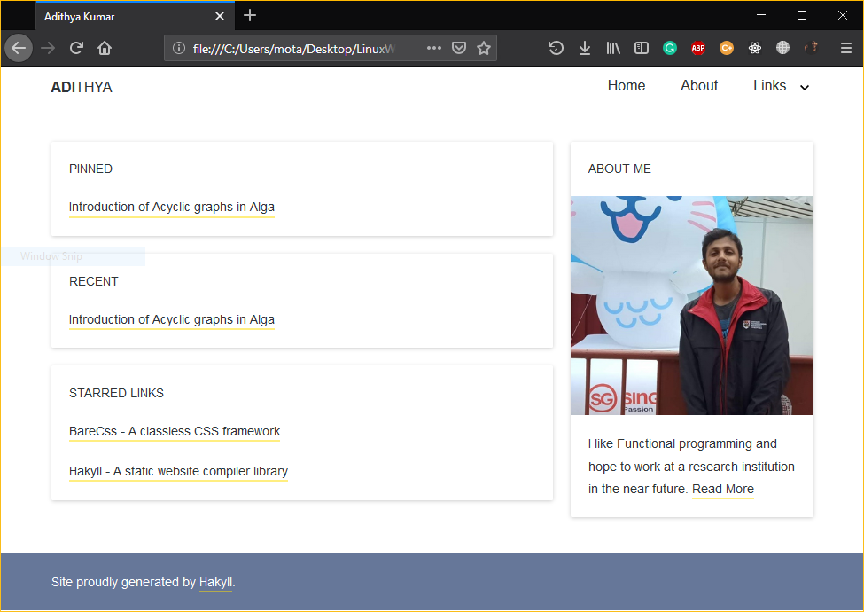

# Read Me :-)

This is a simple Hakyll template made using [BareCss](http://barecss.com/).

It looks like the following, (Please ignore my face :P)



Live demo: [adithyaov.github.io](https://www.adithyaov.github.io)

## Modifying

### Changing the name and default author

Ideally, I should create a default `init` file to for initialization
information which I will do in the near future.
In the mean time you need to perform the following changes,

1. Change `templates/wrapper.html`. Replace **Adithya** with your own
beautiful name.  
2. Change `Main.hs`. Replace **Adithya Kumar** with default author name.

And you're done :-).

### Adding an additional section

Similar to **PINNED** you may choose to add an additional section.

All you have to do is,

Edit `Main.hs`, extend the following part,
```
let pinned = filterCategory "pinned" =<< recentFirst posts
    recent = take 5 <$> recentFirst posts
```
```
( wList "recent" recent
. wList "pinned" pinned 
. wConst "starred" starred
$ defaultContext ) >>=
```
to say,
```
let pinned = filterCategory "pinned" =<< recentFirst posts
    poems = filterCategory "poems" =<< recentFirst posts
    recent = take 5 <$> recentFirst posts
```
```
( wList "recent" recent
. wList "pinned" pinned 
. wList "poems" poems
. wConst "starred" starred
$ defaultContext ) >>=
```

Edit `templates/index.html` and add another `card` under `<div col="2/3">`
```
...
<card>
<h6>Poems</h6>
$for(poems)$
  <p><a href="$url$">$title$</a></p>
$endfor$
</card>
...
```

**Hope you find this useful**
